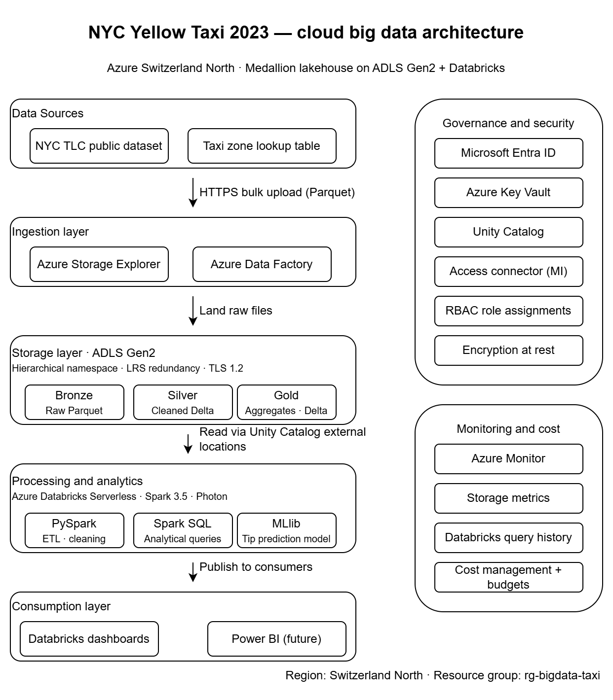

# Big Data Analytics on Azure — NYC Yellow Taxi 2023

A cloud-native big data architecture for ingesting, processing, analysing, and modelling
the **NYC Taxi & Limousine Commission (TLC) Yellow Taxi Trip Records** for 2023.

Built end-to-end on **Microsoft Azure** using the lakehouse pattern, with **Azure
Databricks Serverless** for distributed compute, **Azure Data Lake Storage Gen2** for
medallion-architecture storage, and **Unity Catalog** for fine-grained governance.

> **Academic submission** — York St John University, BDCC module assignment.

---

## At a Glance

| Metric                     | Value                                 |
| -------------------------- | ------------------------------------- |
| **Records processed**      | 38,310,226                            |
| **Compressed size**        | 606.3 MB (Parquet + Snappy)           |
| **In-memory size**         | ~3 GB (Spark)                         |
| **Silver layer (cleaned)** | 35,575,601 records (7.14% removed)    |
| **Gold layer aggregates**  | 6 Delta tables                        |
| **ML model R²**            | 0.5917 (tip-amount linear regression) |
| **Total Azure cost**       | £4.16                                 |
| **Hosting region**         | Switzerland North                     |

---

## Architecture

The solution implements the **medallion lakehouse pattern** with five processing layers
and two cross-cutting concerns (governance + monitoring):



| Layer           | Service / Technology                                                      |
| --------------- | ------------------------------------------------------------------------- |
| **Sources**     | NYC TLC CloudFront endpoint (HTTPS)                                       |
| **Ingestion**   | Azure Storage Explorer, Azure Data Factory, Databricks notebooks          |
| **Storage**     | Azure Data Lake Storage Gen2 (bronze / silver / gold containers)          |
| **Processing**  | Azure Databricks Serverless (Spark 3.5, Photon, MLlib, Spark SQL)         |
| **Consumption** | Databricks dashboards (Power BI integration planned)                      |
| **Governance**  | Microsoft Entra ID, Azure Key Vault, Unity Catalog, Access Connector      |
| **Monitoring**  | Azure Monitor, Storage Metrics, Databricks Query History, Cost Management |

---

## Repository Structure

```
bigdata-azure-taxi-analytics/
├── README.md                     ← this file
├── .gitignore
├── notebooks/
│   ├── 01_explore_data.ipynb     ← bronze-layer exploration + data quality
│   ├── 02_clean_transform.ipynb  ← bronze → silver cleaning pipeline
│   └── 03_analysis_ml.ipynb      ← analytics, gold aggregates, MLlib model
├── diagrams/
│   └── architecture_diagram.png
```

---

## Notebooks Overview

### 1. `01_explore_data.ipynb` — Data Exploration

- Configures Unity Catalog External Location paths
- Lists 12 monthly parquet files (606.3 MB total)
- Loads all 38.3M records into Spark
- Prints schema (19 columns)
- Performs data quality assessment

### 2. `02_clean_transform.ipynb` — Bronze → Silver

- Handles schema drift (INT64 vs DOUBLE inconsistencies across months)
- Applies cleaning rules: nulls, outliers, sanity bounds
- Engineers 9 derived features (`trip_duration_min`, `pickup_hour`,
  `time_of_day`, `trip_distance_bucket`, `tip_pct`, etc.)
- Writes Delta Lake table to silver, partitioned by month
- Result: **35,575,601 clean records, 28 columns**

### 3. `03_analysis_ml.ipynb` — Analytics & Machine Learning

- Six analytical Spark SQL queries (monthly, hourly, day-of-week, top zones,
  tipping behaviour, payment mix)
- Writes 6 aggregate Delta tables to gold layer
- Trains a **Spark MLlib Linear Regression** model for tip-amount prediction
  - Training set: 23,297,102 records
  - Test set: 5,825,230 records
  - **Test R²: 0.5917, RMSE: $2.54, MAE: $1.39**
  - Dominant feature: `trip_distance` (coefficient 0.1622)

---

## How to Reproduce

### Prerequisites

- Microsoft Azure subscription (Azure for Students is sufficient)
- Resources required (all in the same region — recommend Switzerland North):
  - Storage Account (ADLS Gen2 with hierarchical namespace)
  - Azure Databricks workspace (Premium tier, Serverless)
  - Azure Key Vault (RBAC permission model)
  - Access Connector for Azure Databricks

### Setup Steps

1. **Provision Azure resources** as listed above. Place them all in one resource
   group, one region.

2. **Create three containers** in the storage account: `bronze`, `silver`, `gold`.

3. **Configure Unity Catalog**:
   - Grant the Access Connector's managed identity the `Storage Blob Data Contributor`
     role on the storage account.
   - In Databricks → Catalog → External Data → create a Storage Credential
     pointing at the Access Connector.
   - Create three External Locations: `ext-bronze`, `ext-silver`, `ext-gold`,
     each mapped to its corresponding ADLS container.

4. **Download the dataset** (12 monthly Parquet files for 2023):

   ```powershell
   1..12 | ForEach-Object {
       $m = "{0:D2}" -f $_
       Invoke-WebRequest `
           -Uri "https://d37ci6vzurychx.cloudfront.net/trip-data/yellow_tripdata_2023-$m.parquet" `
           -OutFile "yellow_tripdata_2023-$m.parquet"
   }
   ```

5. **Upload to bronze container** under the path `bronze/yellow_taxi/2023/`.

6. **Import the notebooks** into your Databricks workspace.

7. **Update the storage account name** in each notebook's setup cell:

   ```python
   storage_account_name = "<your_storage_account_name>"
   ```

8. **Execute notebooks in order**: 01 → 02 → 03.

---

## Dataset Source

NYC Taxi & Limousine Commission (TLC) Trip Record Data.
Available from: <https://www.nyc.gov/site/tlc/about/tlc-trip-record-data.page>

Published under an open data licence. No personally identifiable information is
included in the published dataset.

---

## Architecture Highlights

- **Lakehouse on open formats** — All data persisted as Parquet (bronze) and
  Delta Lake (silver/gold) for portability and ACID guarantees.
- **Serverless compute** — pay-per-second, auto-pause; total project cost £4.16.
- **Schema drift handling** — explicit column-type normalisation across monthly files
  (a known TLC publishing quirk).
- **Least-privilege RBAC** — layered access control: Key Vault Secrets Officer for
  users, Key Vault Secrets User for the Databricks service principal, Storage Blob
  Data Contributor for the Access Connector managed identity.
- **Partition pruning** — silver/gold Delta tables partitioned by `pickup_month_num`
  for sub-linear query scaling.

---

## Cost Breakdown

| Service                                       | Cost (GBP) |
| --------------------------------------------- | ---------- |
| Azure Databricks                              | £4.15      |
| Storage Account                               | <£0.01     |
| Azure Synapse Analytics (initial exploration) | <£0.01     |
| Azure Key Vault                               | <£0.01     |
| Bandwidth                                     | £0.00      |
| **Total**                                     | **£4.16**  |

---

## License & Attribution

This repository is provided for academic and educational purposes as part of a
university assignment. The NYC TLC dataset is published under an open data
licence by the New York City government.

If you find this useful, attribution to the original authors and the source
dataset is appreciated.

---

## Contact

**Author:** Kamal Chand
**Institution:** York St John University
**Module:** [Big Data and Cloud Computing]
**Year:** 2026
